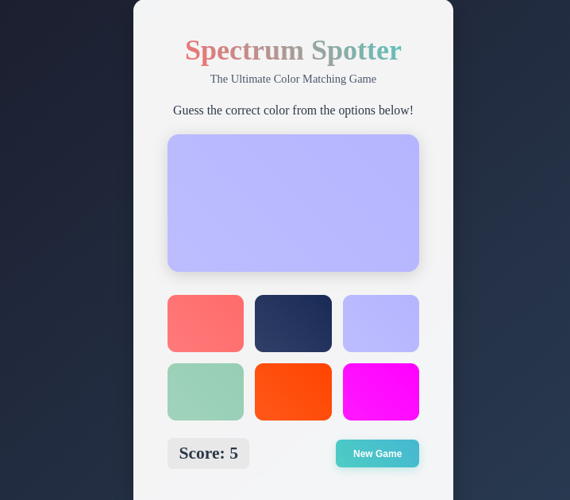

# Spectrum Spotter

## Overview
The **Spectrum Spotter** is a simple and engaging game where players guess the correct color from a set of options. The game provides visual feedback and keeps track of the player's score.

## Screenshot




## Features
- Randomly generated target color
- Multiple color options to choose from
- Score tracking for correct guesses
- Feedback on each guess (correct or incorrect)
- New game button to reset and start a fresh round
- Responsive and user-friendly design

## How to Play

Observe the displayed target color box.

Click on the color option that matches the target color.

If your guess is correct, your score increases, and a new color appears.

If incorrect, try again until you select the correct color.

Click the New Game button to reset the game at any time.

## Technologies Used
- React
- Html
- CSS (for styling)

## Installation
```bash
# Clone the repository
git clone https://github.com/9ightshade/SpectrumSpotter.git

# Navigate to the project directory
cd spectrum-spotter

# Install dependencies
pnpm install

# Start the development server
pnpm run dev